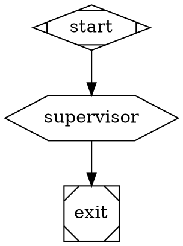
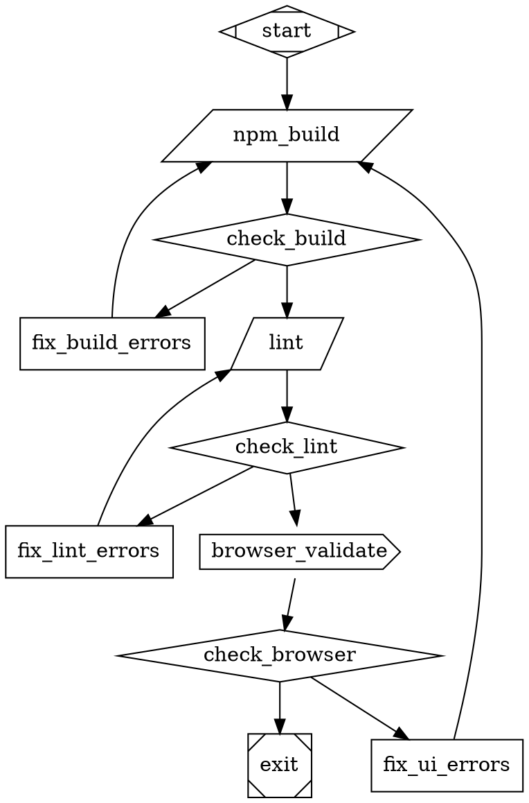

# Attractor implementation & Visual Builder by Arga Labs
An implementation of the nlspec in https://github.com/strongdm/attractor by StrongDM

A DOT-based pipeline runner for multi-stage AI workflows, with a visual browser-based builder for designing pipelines without writing any code.

Walkthrough here: https://www.youtube.com/watch?v=l_FyHaCm2jk

---

## Contents

- [Overview](#overview)
- [Quick Start](#quick-start)
- [Using the Visual Builder](#using-the-visual-builder)
  - [Adding Nodes](#adding-nodes)
  - [Connecting Nodes](#connecting-nodes)
  - [Node Types](#node-types)
  - [Defining Conditions](#defining-conditions)
  - [Pipeline Settings](#pipeline-settings)
  - [Viewing the DOT Source](#viewing-the-dot-source)
- [The Manager Loop](#the-manager-loop)
- [MCP (Model Context Protocol)](#mcp-model-context-protocol)
- [External Skills and Tool Calls](#external-skills-and-tool-calls)
- [Example: Build, Lint, and Browser-Validate a Web App](#example-build-lint-and-browser-validate-a-web-app)
- [Running & Validating a Pipeline](#running--validating-a-pipeline)
- [API Reference](#api-reference)
- [Environment Variables](#environment-variables)
- [Running Tests](#running-tests)

---

## Overview

Attractor pipelines are directed graphs described in [Graphviz DOT syntax](https://graphviz.org/doc/info/lang.html). Each node in the graph is a **stage** — an LLM call, a shell command, an HTTP request to an external skill, a human approval step, or a branching point. Edges carry optional **conditions** that determine which path the engine takes at runtime.

The visual builder lets you design these graphs in a browser, then validate or run them against the HTTP API backend.

---

## Quick Start

**Requirements:** Python 3.11+, Node.js 18+

### Option A — Use the pre-built frontend (no Node.js needed)

```bash
# 1. Clone and install
git clone https://github.com/ArgaLabs/agent-builder
cd agent-builder
pip install -e ".[dev]"

# 2. Add your API keys
cat > .env << 'EOF'
ANTHROPIC_API_KEY=sk-ant-...
OPENAI_API_KEY=sk-proj-...
GEMINI_API_KEY=AIza...
EOF

# 3. Start the backend server (serves the pre-built React app)
python -m attractor.server

# 4. Open the visual builder
open http://localhost:8000
```

### Option B — Run the frontend dev server (hot reload)

```bash
# Terminal 1 — backend
python -m attractor.server          # http://localhost:8000

# Terminal 2 — frontend (Vite dev server with proxy to backend)
cd frontend
npm install
npm run dev                         # http://localhost:3000
```

The Vite dev server proxies `/pipelines`, `/validate`, and `/generate-dot` to the backend at `localhost:8000`, so you can work on the UI with instant hot reload.

### Rebuilding the frontend

```bash
cd frontend
npm run build   # outputs to attractor/server/static/
```

Commit the built files so the backend can serve the app without Node.js.

The server starts on **http://localhost:8000** by default. The visual builder is served from the same origin at `/`.

---

## Using the Visual Builder

The builder is a single-page app at `http://localhost:8000`. It has three panels:

| Panel | Purpose |
|---|---|
| **Left** | Node palette, connection tool, pipeline settings |
| **Center** | Interactive graph canvas |
| **Right** | Properties for the selected node or edge |

### Adding Nodes

Click any node type in the left panel to add it to the canvas. The node appears near the center — drag it to reposition. You can add multiple nodes of the same type (except **Start** and **Exit**, which are singletons).

### Connecting Nodes

1. Click **Connect Nodes** in the left panel (it turns blue when active).
2. Click the **source** node — it highlights with a blue border.
3. Click the **target** node — an arrow is drawn between them.
4. Click **Cancel** or press the button again to exit connection mode.

Each arrow is an **edge**. Click any edge on the canvas to open its properties in the right panel.

### Node Types

| Node | Purpose |
|---|---|
| **Start** | Entry point — every pipeline must have exactly one. |
| **LLM Call** | Sends a prompt to a language model and stores the response in pipeline context. |
| **Conditional** | Routing node — evaluates conditions on outgoing edges and follows the first match. |
| **Human Gate** | Pauses execution and waits for a human to approve or reject before continuing. |
| **Tool / Shell** | Runs a shell command and captures stdout/stderr into the pipeline context. |
| **HTTP Request** | Calls an external URL (GET/POST/PUT/etc.). Use for webhooks, browser APIs, or any external skill. |
| **Parallel Fork** | Fans out — launches multiple branches concurrently. |
| **Fan-In Join** | Collects results from all parallel branches before continuing. |
| **Manager Loop** | Supervisor node — observes a sub-pipeline and can steer or abort it. |
| **Exit** | Terminal node — every pipeline must have exactly one. |

Click a node on the canvas to edit its properties in the right panel. Fields vary by node type.

---

### Defining Conditions

> **Key concept:** conditions are set on **edges** (arrows), not on nodes.

A **Conditional** node is just a routing point. The logic lives on the arrows leaving it. When the engine reaches a Conditional node, it evaluates each outgoing edge's condition in order and takes the first one that matches.

**How to set a condition:**

1. Add a **Conditional** node and connect it to two or more target nodes.
2. Click the **Conditional** node — the right panel lists its outgoing edges.
3. Click an edge in that list (or click the arrow directly on the canvas).
4. In the right panel, fill in the **Condition** field.

**Condition syntax:**

| Expression | Meaning |
|---|---|
| `outcome=success` | The previous node's outcome equals `success` |
| `outcome=failure` | The previous node's outcome equals `failure` |
| `http.status_code=200` | An HTTP node returned status 200 |
| `tool.exit_code=0` | A shell command exited cleanly |
| `key!=value` | Not-equals check |
| `a=1 && b=2` | Both conditions must be true (AND) |
| *(empty)* | Default / fallback — always matches |

The engine checks edges in the order they appear in the DOT file (top-to-bottom as drawn). **Leave one edge with no condition** as a catch-all fallback to avoid a dead-end.

---

### Pipeline Settings

The **Pipeline Settings** section in the left panel applies to the whole graph:

| Field | Purpose |
|---|---|
| **Name** | The graph name used in the DOT `digraph` declaration. |
| **Goal** | A plain-language description stored as a graph attribute. LLM nodes can reference it via `$goal`. |
| **Model Stylesheet** | CSS-like rules that assign LLM models to nodes. Applied before execution. |

**Model Stylesheet syntax:**

```css
/* All nodes use Sonnet by default */
* { llm_model: claude-sonnet-4-5; }

/* Nodes with class "heavy" use Opus instead */
.heavy { llm_model: claude-opus-4-6; }

/* A specific node by ID */
#review_code { llm_model: gpt-5.2; }
```

Individual nodes can override the stylesheet model using the **LLM Model Override** dropdown in the node's properties panel.

---

### Viewing the DOT Source

Click **Source** in the top bar to toggle a panel at the bottom that shows the generated DOT file in real time. Click **Copy** to copy it to the clipboard.

---

## The Manager Loop

The **Manager Loop** (`manager_loop` handler, `hexagon` shape in DOT) is the supervisor node. Unlike a regular LLM Call that sends one prompt and moves on, the Manager runs a repeating **observe → guard → steer** cycle that lets a second agent watch and correct a first one mid-execution — without restarting from scratch.

### When to use it

Use a Manager Loop when you need an agent to be *watched* rather than just *run*:

- An LLM generates code over many tool-call turns — a manager checks quality and injects corrections if it drifts
- A long-running agent is prone to getting stuck in loops — a manager detects this and nudges it back on track
- You want a "senior" model (e.g. Opus) to supervise a "junior" model (e.g. Sonnet) doing the actual work
- You need a budget or safety guardrail that can abort a sub-task before it runs too long

### The observe → guard → steer cycle

Each cycle of the Manager Loop runs three hooks in sequence:

```
┌──────────────────────────────────────────────────────┐
│  CYCLE 1..max_cycles                                  │
│                                                       │
│  1. observe_fn(input)  → observation                 │
│     Inspect the pipeline context, agent output,       │
│     tool call history, or any external state.         │
│                                                       │
│  2. guard_fn(input, observation)  → bool             │
│     Return False to stop the cycle early (success).   │
│     Return True to continue to the steer step.        │
│                                                       │
│  3. steer_fn(input, observation)                     │
│     Inject a steering message into the agent session. │
│     session.steer("Please focus on X, not Y.")       │
└──────────────────────────────────────────────────────┘
```

After `max_cycles` the node always exits with `SUCCESS` and writes `manager.cycles` to context. The guard can exit early at any cycle.

### In the visual builder

Select a **Manager Loop** node and set:

| Field | Effect |
|---|---|
| **Prompt** | The initial instruction sent to the managed agent at the start of the cycle. Supports `$goal` and `${key}` interpolation. |
| **Max Cycles** | How many observe/guard/steer passes to run before exiting. Default: 3. The guard hook can exit early at any cycle. |
| **LLM Model Override** | The model used for this supervisor node's own LLM calls. |

The observe/guard/steer logic itself requires Python hooks (see below).

### In Python — wiring the hooks

```python
from attractor.pipeline.handlers.base import HandlerInput
from attractor.pipeline.handlers.manager import ManagerLoopHandler
from attractor.pipeline.engine import create_default_registry, run

async def observe(input: HandlerInput):
    """Read whatever state you care about."""
    last_response = input.context.get("last_response", "")
    cycles_done = input.context.get("manager.cycles", 0)
    return {"last_response": last_response, "cycles": cycles_done}

async def guard(input: HandlerInput, obs) -> bool:
    """Return False to stop the loop early (task done), True to keep going."""
    response = obs["last_response"]
    # Stop as soon as the agent says it's finished
    if "DONE" in response or "complete" in response.lower():
        return False
    # Also stop if the response looks reasonable (>200 chars of actual content)
    if len(response) > 200:
        return False
    return True  # keep cycling

async def steer(input: HandlerInput, obs) -> None:
    """Inject a correction into the running agent session."""
    # input.extra["session"] is set when the pipeline is wired to a Session
    session = input.extra.get("session")
    if session:
        session.steer(
            "Your last response was too short. Please provide a complete, "
            "detailed answer and end with the word DONE."
        )

# Register the custom manager
registry = create_default_registry(backend=my_backend)
registry.register(
    "manager_loop",
    ManagerLoopHandler(observe_fn=observe, guard_fn=guard, steer_fn=steer),
)

result = await run(graph, registry=registry)
print(f"Manager ran {result.final_context.get('manager.cycles')} cycles")
```

### Session steering

Steering injects a `[STEERING]` message into the active agent's conversation mid-turn. The agent sees it as a user message and adjusts without losing its conversation history or tool call context:

```python
session.steer("Focus on test coverage, not implementation.")
session.steer("The file path is wrong — use /workspace/src, not /src.")
```

This is more efficient than a retry (which discards everything) and more targeted than a follow-up (which starts a new turn).

### Supervisor pattern — Opus watches Sonnet

A common production pattern: use a cheap fast model for the work and an expensive capable model as the supervisor.



### How Manager Loop differs from LLM Call and Parallel Fork

| Node | What it does |
|---|---|
| **LLM Call** | Single prompt → single response → move on |
| **Manager Loop** | Repeated observe/guard/steer cycle; can correct a running agent |
| **Parallel Fork** | Fans out to multiple branches running concurrently |

The Manager Loop is the only node that can *modify an in-progress agent session*. LLM Call and Tool nodes run and exit; Manager Loop stays in the driver's seat for multiple passes.

### Context keys written by Manager Loop

| Key | Value |
|---|---|
| `manager.cycles` | Number of cycles completed before exit |

---

## MCP (Model Context Protocol)

Attractor has first-class support for [MCP](https://modelcontextprotocol.io) — the open standard for connecting LLMs to external tool servers. Any MCP-compatible server (filesystem, GitHub, Slack, Playwright, your own custom server, etc.) can be wired into an LLM Call node so the model can invoke those tools mid-pipeline.

### How it works

The MCP client connects to a server, calls `tools/list` to discover available tools, then wraps each one as an Attractor `Tool` object. Those tools are passed alongside the prompt when the LLM is invoked — the model decides which tools to call, the client executes them, and the results flow back into the conversation automatically.

### In the visual builder

On any **LLM Call** or **Manager Loop** node, the **MCP Servers** field accepts one server per line:

```
# stdio — the full launch command for a local server
npx -y @modelcontextprotocol/server-filesystem /workspace
npx -y @modelcontextprotocol/server-github

# HTTP — the base URL of a remote server
http://localhost:3001
https://my-mcp-skill.internal
```

The engine connects to each listed server at pipeline start and makes their tools available to the LLM at that node.

### In Python — pipeline

```python
from attractor.mcp import MCPSession
from attractor.pipeline.engine import create_default_registry, run

async with MCPSession() as mcp:
    # Attach a local filesystem server
    await mcp.add_stdio(
        label="filesystem",
        cmd="npx", "-y", "@modelcontextprotocol/server-filesystem", "/workspace",
    )
    # Attach a remote browser-automation skill server
    await mcp.add_http(label="browser", base_url="http://localhost:3001")

    registry = create_default_registry(backend=my_backend, mcp_session=mcp)
    result = await run(graph, registry=registry)
    # Every LLM Call node in the pipeline now has access to filesystem + browser tools
```

### In Python — generate() directly

```python
from attractor.mcp import MCPClient, load_mcp_tools
from attractor.llm.generate import generate

async with MCPClient.stdio("npx", "-y", "@modelcontextprotocol/server-filesystem", "/ws") as client:
    tools = await load_mcp_tools(client)
    result = await generate(
        model="claude-sonnet-4-5",
        prompt="List the files in /ws and summarise what this project does.",
        tools=tools,
        max_tool_rounds=5,
    )
    print(result.text)
```

### In Python — agent session

```python
from attractor.mcp import MCPClient
from attractor.agent.tools.registry import ToolRegistry

registry = ToolRegistry()

async with MCPClient.stdio("npx", "-y", "@modelcontextprotocol/server-github") as client:
    names = await registry.mcp_connect(client)
    print(f"Registered MCP tools: {names}")
    # ['create_issue', 'list_prs', 'get_file_contents', ...]
```

### Popular MCP servers

| Server | Install | What it gives the LLM |
|---|---|---|
| Filesystem | `npx -y @modelcontextprotocol/server-filesystem <dir>` | Read/write local files |
| GitHub | `npx -y @modelcontextprotocol/server-github` | Issues, PRs, file content |
| Playwright | `npx -y @modelcontextprotocol/server-playwright` | Browser automation |
| Slack | `npx -y @modelcontextprotocol/server-slack` | Post messages, read channels |
| Fetch | `npx -y @modelcontextprotocol/server-fetch` | Fetch any URL |
| PostgreSQL | `npx -y @modelcontextprotocol/server-postgres <conn>` | Query a database |
| Custom | Any HTTP server implementing `POST /mcp` (JSON-RPC 2.0) | Whatever you expose |

### Writing a custom MCP server

Any HTTP server that accepts `POST /mcp` with JSON-RPC 2.0 payloads and responds to `initialize`, `tools/list`, and `tools/call` is a valid MCP server. A minimal FastAPI example:

```python
from fastapi import FastAPI
from pydantic import BaseModel

app = FastAPI()

TOOLS = [{
    "name": "validate_page",
    "description": "Load a URL in a headless browser and check for errors.",
    "inputSchema": {
        "type": "object",
        "properties": {"url": {"type": "string"}},
        "required": ["url"],
    },
}]

@app.post("/mcp")
async def mcp(req: dict):
    method = req.get("method")
    rid = req.get("id")
    if method == "initialize":
        return {"jsonrpc": "2.0", "id": rid, "result": {"protocolVersion": "2024-11-05", "capabilities": {}}}
    if method == "tools/list":
        return {"jsonrpc": "2.0", "id": rid, "result": {"tools": TOOLS}}
    if method == "tools/call":
        url = req["params"]["arguments"]["url"]
        # ... run headless browser ...
        return {"jsonrpc": "2.0", "id": rid, "result": {"content": [{"type": "text", "text": "No errors found"}]}}
```

---

## External Skills and Tool Calls

Attractor supports external skills at two levels:

### 1. Shell-based skills (Tool / Shell node)

Any skill that can be invoked from the command line works directly as a **Tool / Shell** node:

| Skill | Command |
|---|---|
| Run tests | `npm test` |
| Lint | `npx eslint src/ --max-warnings 0` |
| Build | `npm run build` |
| Playwright browser tests | `npx playwright test` |
| Lighthouse audit | `npx lighthouse https://localhost:3000 --output json` |
| Any CLI tool | `your-tool --flag` |

The node captures `stdout`, `stderr`, and `exit_code` into the pipeline context. Use a **Conditional** node after it with `tool.exit_code=0` to branch on success/failure.

### 2. HTTP-based skills (HTTP Request node)

Any skill that exposes an HTTP API works as an **HTTP Request** node. This covers:

- **Browser automation services** — BrowserStack Automate, Sauce Labs, LambdaTest
- **Custom skill servers** — your own FastAPI or Express microservice
- **MCP tool servers** — any MCP server with an HTTP transport
- **Webhooks** — GitHub Actions, Slack, PagerDuty, etc.
- **External AI services** — vision APIs, document parsers, code scanners

**HTTP node fields:**

| Field | Description |
|---|---|
| **URL** | Full endpoint URL. Supports `${variable}` interpolation from pipeline context. |
| **Method** | GET, POST, PUT, PATCH, or DELETE. |
| **Request Body** | JSON string to POST. Supports `${variable}` interpolation. |
| **Headers** | JSON object of headers. Use `{"Authorization": "Bearer ${MY_TOKEN}"}`. |

**Response context keys written after the request:**

| Key | Value |
|---|---|
| `http.status_code` | Integer status code (e.g. `200`) |
| `http.body` | Raw response body text |
| `http.json` | Parsed JSON object (if response is JSON) |
| `outcome` | `"success"` for 2xx, `"failure"` otherwise |

**Example: call a Playwright-as-a-service endpoint**

```dot
browser_check [shape=cds, url="https://my-browser-service.internal/run",
               method="POST",
               body="{\"url\": \"https://localhost:3000\", \"checks\": [\"title\", \"cta\"]}"]
```

### 3. Writing a custom Python handler

For full control, implement the `Handler` interface and register it before calling `run()`:

```python
from attractor.pipeline.handlers.base import Handler, HandlerInput
from attractor.pipeline.outcome import Outcome, StageStatus
from attractor.pipeline.engine import create_default_registry, run

class SlackNotifyHandler(Handler):
    async def execute(self, input: HandlerInput) -> Outcome:
        message = input.node.attrs.get("message", "Pipeline reached this stage.")
        # ... call Slack API ...
        return Outcome(status=StageStatus.SUCCESS, message="Slack notified")

registry = create_default_registry()
registry.register("slack", SlackNotifyHandler())

# Now any node with shape=slack in your DOT file will use this handler
await run(graph, registry=registry)
```

---

## Example: Build, Lint, and Browser-Validate a Web App

This pipeline builds a frontend app, checks for lint errors, asks an LLM to review the build output, then uses a browser automation step to validate the live page — looping back to fix issues if any check fails.

### Pipeline flow

```
start
  ↓
npm_build         [Tool: npm run build]
  ↓
check_build       [Conditional]
  ├─(outcome=failure)→ fix_build_errors  [LLM: fix the build errors]
  │                        ↓ back to npm_build
  └─(outcome=success)→ lint
  ↓
lint              [Tool: npx eslint src/ --max-warnings 0]
  ↓
check_lint        [Conditional]
  ├─(outcome=failure)→ fix_lint_errors   [LLM: fix the lint errors]
  │                        ↓ back to lint
  └─(outcome=success)→ browser_validate
  ↓
browser_validate  [HTTP: POST to Playwright service]
  ↓
check_browser     [Conditional]
  ├─(outcome=failure)→ fix_ui_errors     [LLM: fix the UI issues found]
  │                        ↓ back to npm_build
  └─(outcome=success)→ exit
```

### Steps in the builder

1. Add a **Start** node.
2. Add a **Tool** node, rename it `npm_build`, set command to `npm run build`.
3. Add a **Conditional** node, rename it `check_build`.
4. Add an **LLM Call** node, rename it `fix_build_errors`, set prompt to:
   `The build failed with this output: ${tool.stdout}. Fix the errors and explain what you changed.`
5. Add a **Tool** node, rename it `lint`, set command to `npx eslint src/ --max-warnings 0`.
6. Add a **Conditional** node, rename it `check_lint`.
7. Add an **LLM Call** node, rename it `fix_lint_errors`, set prompt to:
   `ESLint found these warnings/errors: ${tool.stdout}. Fix all of them.`
8. Add an **HTTP Request** node, rename it `browser_validate`. Set:
   - URL: `https://my-playwright-service.internal/validate`
   - Method: `POST`
   - Body: `{"url": "http://localhost:3000", "checks": ["title", "cta_visible", "no_console_errors"]}`
9. Add a **Conditional** node, rename it `check_browser`.
10. Add an **LLM Call** node, rename it `fix_ui_errors`, set prompt to:
    `Browser validation failed: ${http.body}. Fix the UI issues described.`
11. Add an **Exit** node.

**Connect them:**

| From | To | Condition |
|---|---|---|
| `start` | `npm_build` | — |
| `npm_build` | `check_build` | — |
| `check_build` | `fix_build_errors` | `outcome=failure` |
| `fix_build_errors` | `npm_build` | — |
| `check_build` | `lint` | `outcome=success` |
| `lint` | `check_lint` | — |
| `check_lint` | `fix_lint_errors` | `outcome=failure` |
| `fix_lint_errors` | `lint` | — |
| `check_lint` | `browser_validate` | `outcome=success` |
| `browser_validate` | `check_browser` | — |
| `check_browser` | `fix_ui_errors` | `outcome=failure` |
| `fix_ui_errors` | `npm_build` | — |
| `check_browser` | `exit` | `outcome=success` |

12. In **Pipeline Settings**, set **Goal** to describe the app under test.
13. Click **Validate**, then **Run Pipeline**.

### The generated DOT



---

## Running & Validating a Pipeline

| Button | What it does |
|---|---|
| **Validate** | Sends the DOT source to `POST /validate` and shows any lint errors (missing start/exit, unreachable nodes, invalid conditions, etc.). |
| **Run Pipeline** | Sends the DOT source to `POST /pipelines` to start execution. A toast notification shows the pipeline ID and polls for completion. |

---

## API Reference

The backend exposes a REST API at `http://localhost:8000`.

| Method | Path | Description |
|---|---|---|
| `GET` | `/pipelines` | List all pipelines |
| `POST` | `/pipelines` | Create and start a pipeline — body: `{ "dot_source": "..." }` |
| `GET` | `/pipelines/{id}` | Get pipeline status and metadata |
| `DELETE` | `/pipelines/{id}` | Cancel a running pipeline |
| `GET` | `/pipelines/{id}/events` | SSE stream of real-time pipeline events |
| `GET` | `/pipelines/{id}/context` | Get the current pipeline context (key-value store) |
| `GET` | `/pipelines/{id}/question` | Get pending human-gate question (if any) |
| `POST` | `/pipelines/{id}/answer` | Answer a human-gate question — body: `{ "answer": "..." }` |
| `POST` | `/validate` | Validate a DOT string — body: `{ "dot_source": "..." }` |
| `POST` | `/generate-dot` | Generate DOT from a JSON graph definition |
| `GET` | `/` | Serves the visual builder UI |

---

## Environment Variables

| Variable | Required for |
|---|---|
| `ANTHROPIC_API_KEY` | Claude models (Opus, Sonnet) |
| `OPENAI_API_KEY` | GPT models |
| `GEMINI_API_KEY` | Gemini models |
| `HOST` | Server bind address (default: `0.0.0.0`) |
| `PORT` | Server port (default: `8000`) |

---

## Running Tests

```bash
# Run all unit tests
pytest

# Run with coverage
pytest --cov=attractor --cov-report=term-missing

# Run only a specific layer
pytest tests/llm/
pytest tests/agent/
pytest tests/pipeline/

# Run integration tests (requires API keys in .env)
pytest -m integration
```

Tests are organised into three layers matching the codebase:

- `tests/llm/` — Unified LLM client (models, adapters, retry, streaming)
- `tests/agent/` — Coding agent loop (tools, session, profiles, subagents)
- `tests/pipeline/` — Pipeline engine (parser, validator, conditions, handlers)
- `tests/integration/` — End-to-end smoke tests against real APIs
