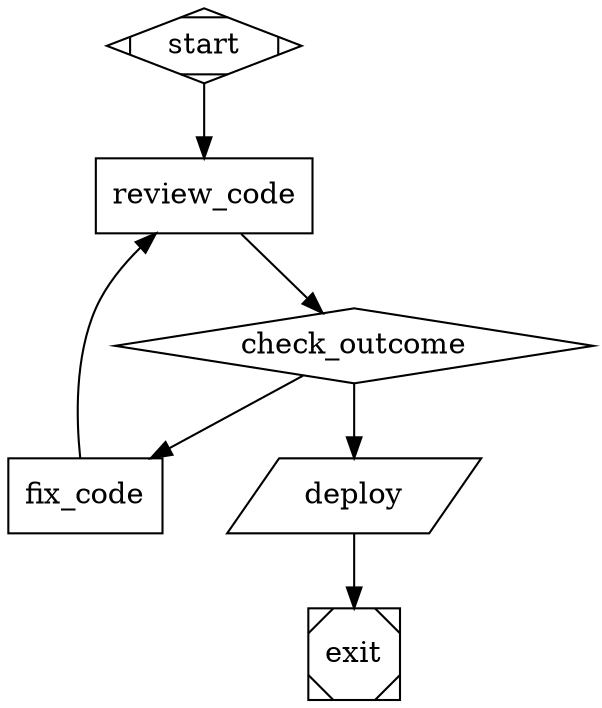

# Attractor Agent Builder

A DOT-based pipeline runner for multi-stage AI workflows, with a visual browser-based builder for designing pipelines without writing any code.

---

## Contents

- [Overview](#overview)
- [Quick Start](#quick-start)
- [Using the Visual Builder](#using-the-visual-builder)
  - [Adding Nodes](#adding-nodes)
  - [Connecting Nodes](#connecting-nodes)
  - [Node Types](#node-types)
  - [Defining Conditions](#defining-conditions)
  - [Pipeline Settings](#pipeline-settings)
  - [Viewing the DOT Source](#viewing-the-dot-source)
- [Example: Code Review Pipeline](#example-code-review-pipeline)
- [Running & Validating a Pipeline](#running--validating-a-pipeline)
- [API Reference](#api-reference)
- [Environment Variables](#environment-variables)
- [Running Tests](#running-tests)

---

## Overview

Attractor pipelines are directed graphs described in [Graphviz DOT syntax](https://graphviz.org/doc/info/lang.html). Each node in the graph is a **stage** — an LLM call, a shell command, a human approval step, or a branching point. Edges between nodes carry optional **conditions** that determine which path the engine takes at runtime.

The visual builder lets you design these graphs in a browser, then validate or run them against the HTTP API backend.

---

## Quick Start

**Requirements:** Python 3.11+

```bash
# 1. Clone and install
git clone https://github.com/your-org/agent-builder
cd agent-builder
pip install -e ".[dev]"

# 2. Create a .env file with your API keys
cp .env.example .env   # or create it manually — see below

# 3. Start the backend server
python -m attractor.server

# 4. Open the visual builder
open http://localhost:8000
```

The server starts on **http://localhost:8000** by default. The visual builder is served from the same origin at `/`.

### .env file

Create a `.env` file in the project root:

```bash
ANTHROPIC_API_KEY=sk-ant-...
OPENAI_API_KEY=sk-proj-...
GEMINI_API_KEY=AIza...
```

You only need keys for the providers you plan to use.

---

## Using the Visual Builder

The builder is a single-page app at `http://localhost:8000`. It has three panels:

| Panel | Purpose |
|---|---|
| **Left** | Node palette, connection tool, pipeline settings |
| **Center** | Interactive graph canvas |
| **Right** | Properties for the selected node or edge |

### Adding Nodes

Click any node type in the left panel to add it to the canvas. The node appears near the centre — drag it to reposition. You can add multiple nodes of the same type (except **Start** and **Exit**, which are singletons).

### Connecting Nodes

1. Click **Connect Nodes** in the left panel (it turns blue when active).
2. Click the **source** node — it highlights with a blue border.
3. Click the **target** node — an arrow is drawn between them.
4. Click **Cancel** or press the button again to exit connection mode.

Each arrow is an **edge**. Click any edge on the canvas to open its properties in the right panel.

### Node Types

| Node | Purpose |
|---|---|
| **Start** | Entry point — every pipeline must have exactly one. |
| **LLM Call** | Sends a prompt to a language model and stores the response in the pipeline context. |
| **Conditional** | Routing node — evaluates conditions on outgoing edges and follows the first match. |
| **Human Gate** | Pauses execution and waits for a human to approve or reject before continuing. |
| **Tool / Shell** | Runs a shell command and captures stdout/stderr into the pipeline context. |
| **Parallel Fork** | Fans out — launches multiple branches concurrently. |
| **Fan-In Join** | Collects results from all parallel branches before continuing. |
| **Manager Loop** | Supervisor node — observes a sub-pipeline and can steer or abort it. |
| **Exit** | Terminal node — every pipeline must have exactly one. |

Click a node on the canvas to edit its properties in the right panel. Fields vary by node type — for example, **LLM Call** and **Manager Loop** show a **Prompt** field, and **Tool / Shell** shows a **Command** field.

---

### Defining Conditions

> **Key concept:** conditions are set on **edges** (arrows), not on nodes.

A **Conditional** node is just a routing point. The logic lives on the arrows leaving it. When the engine reaches a Conditional node, it evaluates each outgoing edge's condition in order and takes the first one that matches.

**How to set a condition:**

1. Add a **Conditional** node and connect it to two or more target nodes.
2. Click the **Conditional** node — the right panel lists its outgoing edges.
3. Click an edge in that list (or click the arrow directly on the canvas).
4. In the right panel, fill in the **Condition** field.

**Condition syntax:**

| Expression | Meaning |
|---|---|
| `outcome=success` | The previous node's outcome equals `success` |
| `outcome=failure` | The previous node's outcome equals `failure` |
| `status=done` | A context key `status` equals `done` |
| `key!=value` | Not-equals check |
| `a=1 && b=2` | Both conditions must be true (AND) |
| *(empty)* | Default / fallback — always matches |

The engine checks edges in the order they appear in the DOT file (top-to-bottom as drawn). Leave one edge with **no condition** as a catch-all fallback.

**Example setup for a code-review branch:**

```
Conditional → fix_code   [condition="outcome=failure"]
Conditional → deploy     [condition="outcome=success"]
Conditional → exit       (no condition — fallback)
```

---

### Pipeline Settings

The **Pipeline Settings** section in the left panel applies to the whole graph:

| Field | Purpose |
|---|---|
| **Name** | The graph name used in the DOT `digraph` declaration. |
| **Goal** | A plain-language description stored as a graph attribute. LLM nodes can reference it via `$goal`. |
| **Model Stylesheet** | CSS-like rules that assign LLM models to nodes. Applied before execution. |

**Model Stylesheet syntax:**

```css
/* All nodes use Sonnet by default */
* { llm_model: claude-sonnet-4-5; }

/* Nodes with class "heavy" use Opus instead */
.heavy { llm_model: claude-opus-4-6; }

/* A specific node by ID */
#review_code { llm_model: gpt-5.2; }
```

Individual nodes can override the stylesheet model using the **LLM Model Override** dropdown in the node's properties panel.

---

### Viewing the DOT Source

Click **Source** in the top bar to toggle a panel at the bottom that shows the generated DOT file in real time. Click **Copy** to copy it to the clipboard. The DOT source is what gets sent to the API when you click Validate or Run Pipeline.

---

## Example: Code Review Pipeline

This pipeline asks an LLM to review code, branches on the outcome, either fixes issues or proceeds to deploy, then exits.

**Steps in the builder:**

1. Add: **Start** → **LLM Call** (rename to `review_code`) → **Conditional** (rename to `check_outcome`) → **Exit**
2. Add another **LLM Call** node, rename it `fix_code`.
3. Add a **Tool / Shell** node, rename it `deploy`, set command to `./deploy.sh`.
4. Connect:
   - `check_outcome` → `fix_code` — set condition `outcome=failure`
   - `fix_code` → `review_code` — (loop back to re-review after fixing)
   - `check_outcome` → `deploy` — set condition `outcome=success`
   - `deploy` → `exit`
5. Click the `review_code` node and set its **Prompt** to: `Review the following code for bugs and security issues: $goal`
6. In **Pipeline Settings**, set **Goal** to the code you want reviewed.
7. Click **Validate** to check the graph, then **Run Pipeline** to execute.

The generated DOT will look like:



---

## Running & Validating a Pipeline

| Button | What it does |
|---|---|
| **Validate** | Sends the DOT source to `POST /validate` and shows any lint errors (missing start/exit, unreachable nodes, invalid conditions, etc.). |
| **Run Pipeline** | Sends the DOT source to `POST /pipelines` to start execution. A toast notification shows the pipeline ID and polls for completion. |

---

## API Reference

The backend exposes a REST API at `http://localhost:8000`.

| Method | Path | Description |
|---|---|---|
| `GET` | `/pipelines` | List all pipelines |
| `POST` | `/pipelines` | Create and start a pipeline — body: `{ "dot_source": "..." }` |
| `GET` | `/pipelines/{id}` | Get pipeline status and metadata |
| `DELETE` | `/pipelines/{id}` | Cancel a running pipeline |
| `GET` | `/pipelines/{id}/events` | SSE stream of real-time pipeline events |
| `GET` | `/pipelines/{id}/context` | Get the current pipeline context (key-value store) |
| `GET` | `/pipelines/{id}/question` | Get pending human-gate question (if any) |
| `POST` | `/pipelines/{id}/answer` | Answer a human-gate question — body: `{ "answer": "..." }` |
| `POST` | `/validate` | Validate a DOT string — body: `{ "dot_source": "..." }` |
| `POST` | `/generate-dot` | Generate DOT from a JSON graph definition |
| `GET` | `/` | Serves the visual builder UI |

---

## Environment Variables

| Variable | Required for |
|---|---|
| `ANTHROPIC_API_KEY` | Claude models (Opus, Sonnet) |
| `OPENAI_API_KEY` | GPT models |
| `GEMINI_API_KEY` | Gemini models |
| `HOST` | Server bind address (default: `0.0.0.0`) |
| `PORT` | Server port (default: `8000`) |

---

## Running Tests

```bash
# Run all unit tests
pytest

# Run with coverage
pytest --cov=attractor --cov-report=term-missing

# Run only a specific layer
pytest tests/llm/
pytest tests/agent/
pytest tests/pipeline/

# Run integration tests (requires API keys in .env)
pytest -m integration
```

Tests are organised into three layers matching the codebase:

- `tests/llm/` — Unified LLM client (models, adapters, retry, streaming)
- `tests/agent/` — Coding agent loop (tools, session, profiles, subagents)
- `tests/pipeline/` — Pipeline engine (parser, validator, conditions, handlers)
- `tests/integration/` — End-to-end smoke tests against real APIs
