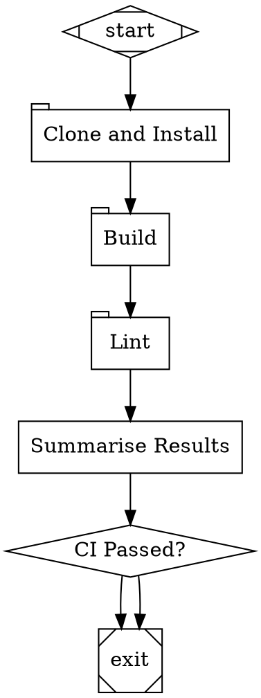
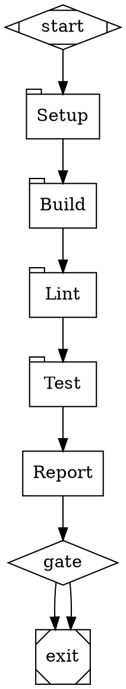
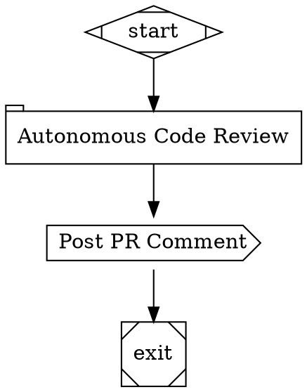
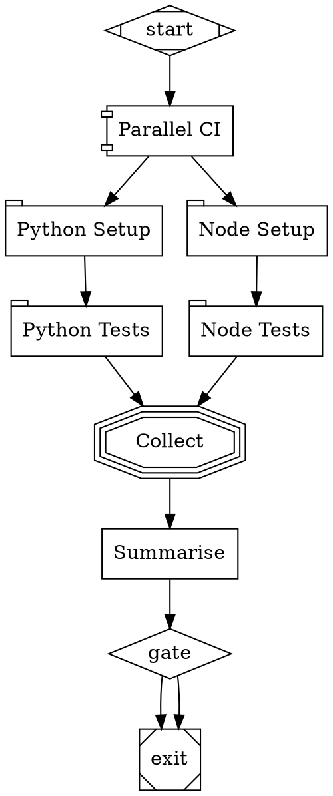

# Sandbox Execution Environment Specification

A local-first, ephemeral workspace layer for AI pipeline agents — one-shot repo cloning, dependency installation, and command execution, with full coding agent autonomy inside an isolated directory tree.

---

## Table of Contents

1. [Overview and Goals](#1-overview-and-goals)
2. [Sandbox Model](#2-sandbox-model)
3. [Sandbox Lifecycle](#3-sandbox-lifecycle)
4. [DOT Schema Extension](#4-dot-schema-extension)
5. [Sandbox Handler](#5-sandbox-handler)
6. [Sandbox Manager](#6-sandbox-manager)
7. [Agent Mode](#7-agent-mode)
8. [Workspace Persistence Across Nodes](#8-workspace-persistence-across-nodes)
9. [Security Model](#9-security-model)
10. [Integration Points](#10-integration-points)
11. [Definition of Done](#11-definition-of-done)

---

## 1. Overview and Goals

### 1.1 Problem Statement

Attractor pipelines can declare tool nodes that run shell commands, but the commands run on the host machine — the same machine serving the API. This creates three hard problems:

1. **No codebase.** The host has no copy of the repository being operated on. Commands like `npm build`, `pytest`, or `eslint .` fail immediately because there are no files to act on.
2. **No isolation.** A broken command (or a prompt injection that produces a hostile command) can touch any file on the host machine, consume unbounded resources, or exfiltrate secrets.
3. **No agent workspace.** A coding agent running in a pipeline node needs a place it can read files, modify them, run the result, iterate, and have those changes persist between pipeline steps — none of which is possible if each tool node is a stateless shell call.

The sandbox layer solves all three: it gives the agent a temporary directory tree that contains a fresh clone of the target repository, the correct language runtime and dependencies, and scoped environment variables — all set up automatically from the pipeline node's attributes, discarded on teardown.

### 1.2 Why Local-First

Cloud sandboxes (E2B, Modal, Docker, GitHub Actions) solve the same problem but introduce network latency, cost per sandbox-minute, account setup, and outbound firewall requirements. For the common case — a developer running Attractor on their own machine to validate a repository they already have access to — a local temp-directory sandbox is faster, free, and requires zero additional infrastructure.

Local sandboxes are sufficient when:

- The host machine already has the required runtimes (Python, Node.js, etc.) installed.
- The codebase fits on local disk (virtually always true).
- The agent is trusted (i.e., the pipeline was authored by the same developer running the server).

When these assumptions break, the sandbox layer's design makes it straightforward to replace the `Sandbox.exec()` primitive with a remote execution provider (see Appendix C).

### 1.3 Design Principles

**Ephemeral by default.** Every sandbox lives in a temp directory under `/tmp/attractor/sandbox/`. It is created for the pipeline run and deleted when the run completes, when the TTL expires, or when the server shuts down. No sandbox state persists across pipeline runs unless explicitly promoted to a permanent location.

**One-shot provisioning.** A sandbox is fully usable after a single `provision()` call: temp dir created, venv or node prefix set up, repository cloned, dependencies installed. Individual pipeline nodes that share a sandbox pay no additional setup cost.

**Workspace persistence within a run.** All pipeline nodes in a single run that reference the same `sandbox.id` in context operate on the same directory tree. Files written by one node are visible to the next. Build artifacts produced in the `build` step survive into the `test` step.

**Agent-first.** The sandbox is designed so that a full coding agent — with read/write/shell/grep tools — can operate inside it without modification. The agent's `ExecutionEnvironment` is simply rooted at the sandbox workspace. Every tool call the agent makes is automatically scoped to the sandbox.

**Cleanup-guaranteed.** Sandboxes are cleaned up on pipeline completion, TTL expiry, server shutdown (`atexit`), and periodic GC. A leaked sandbox is detected and removed on the next server startup.

---

## 2. Sandbox Model

### 2.1 Core Data Model

```
Sandbox:
    id              : String            -- unique sandbox ID (e.g. "sbx_a1b2c3d4")
    workspace_dir   : Path              -- temp dir root (/tmp/attractor/sandbox/{id}/)
    repo_dir        : Path | None       -- cloned repo root, if any ({workspace_dir}/repo/)
    venv_dir        : Path | None       -- Python venv ({workspace_dir}/.venv/)
    node_prefix     : Path | None       -- local node_modules prefix ({workspace_dir}/.node/)
    language        : Language          -- detected or declared runtime
    status          : SandboxStatus     -- provisioning | configuring | ready | executing | torn_down
    created_at      : Timestamp
    last_used_at    : Timestamp
    ttl_seconds     : Integer           -- max lifetime (default: 3600)
    env_vars        : Map<String, String>  -- injected into all exec() calls
    resource_limits : ResourceLimits
    provision_log   : List<String>      -- output from clone + setup commands
```

### 2.2 Status Enum

```
SandboxStatus:
    PROVISIONING   -- temp dir created, venv/node setup in progress
    CONFIGURING    -- repo clone and setup_command running
    READY          -- available for exec() calls
    EXECUTING      -- a command or agent session is currently running
    TORN_DOWN      -- directory removed; sandbox is dead
```

### 2.3 Language Enum

```
Language:
    PYTHON   -- create a .venv, prepend .venv/bin to PATH
    NODE     -- create .node/node_modules, set NODE_PATH and npm prefix
    SHELL    -- no runtime setup; plain bash/sh
    AUTO     -- detect from repo: pyproject.toml/setup.py -> PYTHON, package.json -> NODE, else SHELL
    NONE     -- same as SHELL
```

### 2.4 Resource Limits

```
ResourceLimits:
    max_disk_mb       : Integer    -- max workspace size in MB (default: 2048)
    max_cpu_seconds   : Integer    -- cumulative CPU time across all exec() calls (default: 300)
    max_wall_seconds  : Integer    -- wall-clock time per exec() call; same as node timeout if set
    max_processes     : Integer    -- max concurrent child processes (default: 32)
    network_policy    : NetworkPolicy

NetworkPolicy:
    mode     : "allow" | "deny" | "allowlist"
    hosts    : List<String>   -- for allowlist mode: permitted hostnames/IPs
```

### 2.5 Exec Result

```
ExecResult:
    stdout      : String
    stderr      : String
    exit_code   : Integer
    wall_ms     : Integer    -- wall-clock time of the command
    cpu_ms      : Integer    -- CPU time consumed (best-effort)
    timed_out   : Boolean
```

---

## 3. Sandbox Lifecycle

### 3.1 Phase Overview

```
PROVISION -> CONFIGURE -> READY -> EXECUTE(n times) -> TEARDOWN
```

Each phase corresponds to a distinct set of operations. Phases are sequential; a sandbox in `TORN_DOWN` status cannot be used again.

### 3.2 PROVISION Phase

Creates the filesystem skeleton and the language runtime.

```
FUNCTION provision(id, language, ttl_seconds, resource_limits) -> Sandbox:
    workspace = "/tmp/attractor/sandbox/" + id + "/"
    create_directory(workspace, mode=0o700)
    create_directory(workspace + "repo/")
    create_directory(workspace + "artifacts/")
    create_directory(workspace + "logs/")

    IF language == PYTHON:
        run_command(["python3", "-m", "venv", workspace + ".venv"])
        venv_dir = workspace + ".venv"
        node_prefix = NONE

    IF language == NODE:
        create_directory(workspace + ".node/")
        node_prefix = workspace + ".node"
        venv_dir = NONE

    IF language == SHELL OR language == NONE:
        venv_dir = NONE
        node_prefix = NONE

    IF language == AUTO:
        -- Defer language detection to CONFIGURE phase (need repo files)
        venv_dir = NONE
        node_prefix = NONE

    sandbox = Sandbox(
        id            = id,
        workspace_dir = workspace,
        repo_dir      = workspace + "repo/",
        venv_dir      = venv_dir,
        node_prefix   = node_prefix,
        language      = language,
        status        = SandboxStatus.PROVISIONING,
        created_at    = now(),
        ttl_seconds   = ttl_seconds,
        resource_limits = resource_limits,
    )

    write_json(workspace + ".sandbox.json", sandbox.to_dict())
    RETURN sandbox
```

### 3.3 CONFIGURE Phase

Clones the repository, auto-detects language if needed, and runs the setup command.

```
FUNCTION configure(sandbox, repo_url, branch, setup_command, env_vars, auth_token) -> Void:
    sandbox.status = SandboxStatus.CONFIGURING

    -- 1. Clone repository
    IF repo_url is not empty:
        clone_url = inject_auth(repo_url, auth_token)
        result = exec_raw([
            "git", "clone",
            "--depth=1",
            "--branch", branch,
            clone_url,
            sandbox.repo_dir
        ])
        IF result.exit_code != 0:
            RAISE SandboxConfigureError("git clone failed: " + result.stderr)
        sandbox.provision_log.append("Cloned " + repo_url + "@" + branch)

    -- 2. Auto-detect language if needed
    IF sandbox.language == AUTO:
        IF file_exists(sandbox.repo_dir + "/pyproject.toml") OR
           file_exists(sandbox.repo_dir + "/setup.py"):
            sandbox.language = PYTHON
            run_command(["python3", "-m", "venv", sandbox.workspace_dir + ".venv"])
            sandbox.venv_dir = sandbox.workspace_dir + ".venv"
        ELSE IF file_exists(sandbox.repo_dir + "/package.json"):
            sandbox.language = NODE
            create_directory(sandbox.workspace_dir + ".node/")
            sandbox.node_prefix = sandbox.workspace_dir + ".node"
        ELSE:
            sandbox.language = SHELL

    -- 3. Store env vars (expand any host-side values now)
    sandbox.env_vars = dict(env_vars)

    -- 4. Run setup command (once, during configure)
    IF setup_command is not empty:
        env = build_exec_env(sandbox)
        result = exec_raw(setup_command, cwd=sandbox.repo_dir, env=env, shell=true)
        sandbox.provision_log.extend(result.stdout.split("\n"))
        IF result.exit_code != 0:
            RAISE SandboxConfigureError("setup_command failed: " + result.stderr)

    -- 5. Mark ready
    sandbox.status = SandboxStatus.READY
    sandbox.last_used_at = now()
    write_json(sandbox.workspace_dir + ".sandbox.json", sandbox.to_dict())
```

### 3.4 EXECUTE Phase

Runs a command inside the sandbox. May be called multiple times on the same sandbox from different pipeline nodes.

```
FUNCTION exec(sandbox, command, extra_env, timeout_seconds) -> ExecResult:
    IF sandbox.status == SandboxStatus.TORN_DOWN:
        RAISE SandboxError("Sandbox " + sandbox.id + " has been torn down")

    sandbox.status = SandboxStatus.EXECUTING
    sandbox.last_used_at = now()

    env = build_exec_env(sandbox)
    env.update(extra_env)

    start = now()
    proc = create_subprocess_shell(
        command,
        cwd      = sandbox.repo_dir OR sandbox.workspace_dir,
        env      = env,
        stdout   = PIPE,
        stderr   = PIPE,
    )

    TRY:
        stdout, stderr = wait_for(proc.communicate(), timeout=timeout_seconds)
    CATCH TimeoutError:
        proc.kill()
        sandbox.status = SandboxStatus.READY
        RETURN ExecResult(
            stdout="", stderr="", exit_code=-1,
            wall_ms=timeout_seconds * 1000, timed_out=true
        )

    sandbox.status = SandboxStatus.READY
    RETURN ExecResult(
        stdout    = decode(stdout),
        stderr    = decode(stderr),
        exit_code = proc.returncode,
        wall_ms   = elapsed_ms(start),
        timed_out = false,
    )


FUNCTION build_exec_env(sandbox) -> Map<String, String>:
    -- Start from a minimal env (NOT inheriting the full host env)
    env = {
        "HOME"    : os.environ["HOME"],
        "USER"    : os.environ["USER"],
        "TMPDIR"  : sandbox.workspace_dir + "tmp/",
        "SANDBOX_ID" : sandbox.id,
        "SANDBOX_WORKSPACE" : sandbox.workspace_dir,
    }

    -- Prepend venv or node to PATH
    IF sandbox.venv_dir is not None:
        env["PATH"] = sandbox.venv_dir + "/bin:" + "/usr/local/bin:/usr/bin:/bin"
        env["VIRTUAL_ENV"] = sandbox.venv_dir

    IF sandbox.node_prefix is not None:
        env["PATH"] = sandbox.node_prefix + "/bin:" + env.get("PATH", "/usr/local/bin:/usr/bin:/bin")
        env["NODE_PATH"] = sandbox.node_prefix + "/lib/node_modules"
        env["npm_config_prefix"] = sandbox.node_prefix

    IF sandbox.language == SHELL OR sandbox.language == NONE:
        env["PATH"] = "/usr/local/bin:/usr/bin:/bin"

    -- Inject declared env vars
    env.update(sandbox.env_vars)

    RETURN env
```

### 3.5 TEARDOWN Phase

Removes the sandbox directory tree and marks the sandbox dead.

```
FUNCTION teardown(sandbox) -> Void:
    IF sandbox.status == SandboxStatus.TORN_DOWN:
        RETURN  -- idempotent

    -- Kill any still-running processes in the workspace
    kill_processes_in(sandbox.workspace_dir)

    -- Remove the directory tree
    rmtree(sandbox.workspace_dir, ignore_errors=true)

    sandbox.status = SandboxStatus.TORN_DOWN
    sandbox.last_used_at = now()
```

---

## 4. DOT Schema Extension

### 4.1 New Shape

The sandbox node uses a new DOT shape `tab`. The shape is chosen because it visually suggests a workspace tab or container and does not conflict with any existing Attractor shape.

```
Shape-to-Handler-Type extension:

  tab   ->  sandbox   (Sandboxed command execution or agent session)
```

This extends the mapping table in Attractor spec Section 2.8.

### 4.2 New Node Attributes

All sandbox-specific attributes are prefixed with nothing (they are direct attributes on the node, not namespaced). They are only meaningful when the node's resolved handler type is `sandbox`.

| Key              | Type     | Default      | Description |
|------------------|----------|--------------|-------------|
| `repo_url`       | String   | `""`         | Git clone URL. May embed auth token as `https://token@host/...`. If empty, sandbox starts with an empty workspace. |
| `branch`         | String   | `"main"`     | Branch name, tag, or full commit SHA to check out after clone. |
| `language`       | String   | `"auto"`     | Runtime to provision: `python`, `node`, `shell`, `auto`, `none`. `auto` detects from `pyproject.toml` or `package.json` in the cloned repo. |
| `setup_command`  | String   | `""`         | Shell command run once during sandbox configure (after clone, before any node executes). Typical use: `npm ci`, `pip install -e .[dev]`. |
| `command`        | String   | `""`         | Shell command(s) to execute in this node. Ignored when `agent_mode=true`. |
| `agent_mode`     | Boolean  | `false`      | When `true`, spawns a full coding agent session inside the sandbox instead of running `command`. The node's `prompt` drives the agent. |
| `env_vars`       | String   | `""`         | Newline-separated `KEY=VALUE` pairs. Values may reference pipeline context with `$key` or `${context.key}`. |
| `sandbox_id`     | String   | `""`         | Explicit sandbox ID to reuse. If empty, the handler looks for `sandbox.id` in the pipeline context first, then provisions a new sandbox. |
| `sandbox_ttl`    | Duration | `1h`         | Time-to-live for the sandbox. The sandbox is torn down after this duration regardless of pipeline state. |
| `network`        | String   | `"allow"`    | Network policy for commands running inside the sandbox: `allow` (unrestricted), `deny` (loopback only), or a comma-separated allowlist of hostnames/CIDR ranges. |
| `capture`        | String   | `"stdout"`   | What to write into pipeline context. See Section 4.4. |
| `max_disk_mb`    | Integer  | `2048`       | Maximum workspace directory size in MB. Exceeded size triggers a FAIL outcome. |
| `mcp_servers`    | String   | `""`         | Space-separated `label:command` pairs for MCP servers to attach to the agent session in `agent_mode`. Example: `playwright:npx @playwright/mcp`. |

### 4.3 Inherited Attributes

The following existing Attractor node attributes apply to sandbox nodes with the same semantics as for other node types:

| Key          | Description |
|--------------|-------------|
| `prompt`     | Agent task description (used only when `agent_mode=true`). |
| `timeout`    | Per-command wall-clock timeout. Overrides `max_wall_seconds` in resource limits. |
| `max_retries`| Retry count for failed commands or agent sessions. |
| `goal_gate`  | When `true`, this node must succeed before the pipeline can exit. |
| `label`      | Display name in the visual builder. |
| `llm_model`  | LLM model used for agent sessions (`agent_mode=true`). |
| `llm_provider` | LLM provider for agent sessions. |

### 4.4 Capture Modes

The `capture` attribute controls which outputs are written into the pipeline context after execution:

| Value | Behaviour |
|-------|-----------|
| `stdout` | `sandbox.stdout` = full stdout text. Default. |
| `stderr` | `sandbox.stderr` = full stderr text. |
| `stdout+stderr` | Both `sandbox.stdout` and `sandbox.stderr`. |
| `files:GLOB` | Reads files matching GLOB (relative to `repo_dir`) and writes their contents to `sandbox.file.{relative_path}`. |
| `artifact:PATH` | Copies the file at PATH (relative to `repo_dir`) into the sandbox `artifacts/` directory and writes the artifact path to `sandbox.artifact`. |
| `json:PATH` | Reads the file at PATH, parses it as JSON, and merges the top-level keys into the pipeline context under `sandbox.*`. |

Multiple capture modes may be combined with comma separation: `capture="stdout,artifact:coverage/lcov.info"`.

### 4.5 Minimal Example



In this pipeline:
- `setup` provisions a new sandbox, clones the repo, runs `npm ci`, and writes `sandbox.id` to context.
- `build` and `lint` reuse the same sandbox via `sandbox.id` in context — no re-clone.
- `summarise` is a plain `codergen` node that reads `sandbox.stdout` from context.

---

## 5. Sandbox Handler

### 5.1 Overview

`SandboxHandler` implements the `Handler` interface (Attractor spec Section 4.1). It is registered for the `sandbox` and `tab` type strings. It is responsible for resolving or creating a sandbox, executing the node's command or spawning an agent session, capturing outputs, and returning an `Outcome`.

### 5.2 Main Execution Flow

```
SandboxHandler:
    manager : SandboxManager

    FUNCTION execute(input: HandlerInput) -> Outcome:
        node    = input.node
        context = input.context
        attrs   = node.attrs

        -- 1. Resolve or create the sandbox
        sandbox = resolve_sandbox(attrs, context, manager)
        IF sandbox is None:
            TRY:
                sandbox = manager.provision_and_configure(attrs, context)
            CATCH SandboxError as e:
                RETURN Outcome(status=FAIL, message="Sandbox provision failed: " + str(e))

        -- 2. Expand env_vars from pipeline context
        extra_env = expand_env_vars(attrs.get("env_vars", ""), context)

        -- 3a. Agent mode: spawn a full coding agent session
        IF attrs.get("agent_mode", "false") == "true":
            RETURN run_agent_mode(node, sandbox, context, extra_env)

        -- 3b. Command mode: run the declared command
        command = attrs.get("command", "")
        IF command is empty:
            RETURN Outcome(status=FAIL, message="Sandbox node has no command and agent_mode is false")

        command = expand_context_vars(command, context)
        timeout = node.timeout OR 120
        result  = sandbox.exec(command, extra_env=extra_env, timeout_seconds=timeout)

        -- 4. Capture outputs into context
        updates = capture_outputs(result, attrs.get("capture", "stdout"), sandbox, context)
        updates["sandbox.id"]        = sandbox.id
        updates["sandbox.exit_code"] = result.exit_code
        updates["sandbox.wall_ms"]   = result.wall_ms

        -- 5. Build outcome
        IF result.timed_out:
            RETURN Outcome(
                status  = FAIL,
                message = "Command timed out after " + str(timeout) + "s",
                context_updates = updates,
            )

        IF result.exit_code == 0:
            RETURN Outcome(status=SUCCESS, message=result.stdout, context_updates=updates)
        ELSE:
            RETURN Outcome(
                status  = FAIL,
                message = "Command exited " + str(result.exit_code) + ": " + result.stderr[:500],
                context_updates = updates,
            )
```

### 5.3 Sandbox Resolution

```
FUNCTION resolve_sandbox(attrs, context, manager) -> Sandbox | None:
    -- Explicit sandbox_id attribute on the node takes highest precedence
    explicit_id = attrs.get("sandbox_id", "")
    IF explicit_id is not empty:
        s = manager.get(explicit_id)
        IF s is not None AND s.status != TORN_DOWN:
            RETURN s
        IF s is None:
            RAISE SandboxError("Declared sandbox_id '" + explicit_id + "' not found")

    -- Otherwise look for sandbox.id written by a prior node in this run
    context_id = context.get("sandbox.id", "")
    IF context_id is not empty:
        s = manager.get(context_id)
        IF s is not None AND s.status != TORN_DOWN:
            RETURN s

    -- No existing sandbox found; caller will provision a new one
    RETURN None
```

### 5.4 Context Variable Expansion

```
FUNCTION expand_context_vars(text, context) -> String:
    -- Replace ${context.KEY} and $KEY with context values
    result = text
    FOR EACH key IN context.keys():
        result = result.replace("${context." + key + "}", str(context.get(key, "")))
        result = result.replace("$" + key, str(context.get(key, "")))
    RETURN result


FUNCTION expand_env_vars(env_vars_str, context) -> Map<String, String>:
    -- Parse KEY=VALUE lines and expand context references
    env = {}
    FOR EACH line IN env_vars_str.split("\n"):
        line = line.strip()
        IF "=" IN line:
            key, value = line.split("=", maxsplit=1)
            env[key.strip()] = expand_context_vars(value.strip(), context)
    RETURN env
```

### 5.5 Output Capture

```
FUNCTION capture_outputs(result, capture_spec, sandbox, context) -> Map<String, Any>:
    updates = {}
    modes   = split(capture_spec, ",")

    FOR EACH mode IN modes:
        mode = mode.strip()

        IF mode == "stdout":
            updates["sandbox.stdout"] = result.stdout

        IF mode == "stderr":
            updates["sandbox.stderr"] = result.stderr

        IF mode == "stdout+stderr":
            updates["sandbox.stdout"] = result.stdout
            updates["sandbox.stderr"] = result.stderr

        IF mode starts with "files:":
            glob_pattern = mode[len("files:"):]
            FOR EACH path IN glob(sandbox.repo_dir + "/" + glob_pattern):
                rel = relative_path(path, sandbox.repo_dir)
                updates["sandbox.file." + rel] = read_text(path)

        IF mode starts with "artifact:":
            src_path = sandbox.repo_dir + "/" + mode[len("artifact:"):]
            IF file_exists(src_path):
                dest = sandbox.workspace_dir + "artifacts/" + basename(src_path)
                copy_file(src_path, dest)
                updates["sandbox.artifact"] = dest

        IF mode starts with "json:":
            json_path = sandbox.repo_dir + "/" + mode[len("json:"):]
            IF file_exists(json_path):
                data = read_json(json_path)
                IF data is a dict:
                    FOR EACH (k, v) IN data.items():
                        updates["sandbox." + k] = v

    RETURN updates
```

---

## 6. Sandbox Manager

### 6.1 Overview

`SandboxManager` is a singleton (one per server process) that owns all active sandboxes. It handles provisioning, lookup, GC, and teardown. It registers cleanup hooks on startup so sandboxes are never left behind.

### 6.2 Data Model

```
SandboxManager:
    sandboxes    : Map<String, Sandbox>   -- id -> Sandbox
    max_active   : Integer = 8            -- max concurrent active sandboxes
    base_dir     : Path = "/tmp/attractor/sandbox/"
    gc_interval  : Integer = 60           -- GC check every N seconds
    _gc_task     : AsyncTask | None
```

### 6.3 Core Operations

```
FUNCTION provision_and_configure(attrs, context) -> Sandbox:
    IF count(active_sandboxes) >= max_active:
        evict_oldest_completed()
        IF count(active_sandboxes) >= max_active:
            RAISE SandboxError("Too many active sandboxes (" + str(max_active) + ")")

    id       = "sbx_" + random_hex(8)
    language = Language.from_string(attrs.get("language", "auto"))
    ttl      = parse_duration(attrs.get("sandbox_ttl", "1h"))
    limits   = ResourceLimits(
        max_disk_mb     = integer(attrs.get("max_disk_mb", "2048")),
        network_policy  = NetworkPolicy.from_string(attrs.get("network", "allow")),
    )

    sandbox = provision(id, language, ttl, limits)
    sandboxes[id] = sandbox

    configure(
        sandbox,
        repo_url      = attrs.get("repo_url", ""),
        branch        = attrs.get("branch", "main"),
        setup_command = expand_context_vars(attrs.get("setup_command", ""), context),
        env_vars      = parse_env_vars(attrs.get("env_vars", "")),
        auth_token    = context.get("GH_TOKEN", ""),
    )

    RETURN sandbox


FUNCTION get(id) -> Sandbox | None:
    RETURN sandboxes.get(id, None)


FUNCTION teardown(id) -> Void:
    sandbox = sandboxes.get(id)
    IF sandbox is not None:
        sandbox.teardown()
        del sandboxes[id]


FUNCTION teardown_all() -> Void:
    FOR EACH id IN list(sandboxes.keys()):
        teardown(id)


FUNCTION gc() -> Void:
    now = current_time()
    FOR EACH (id, sandbox) IN list(sandboxes.items()):
        IF sandbox.status == TORN_DOWN:
            del sandboxes[id]
            CONTINUE
        age = now - sandbox.created_at
        IF age > sandbox.ttl_seconds:
            teardown(id)


FUNCTION evict_oldest_completed() -> Void:
    -- Remove the oldest READY (not currently EXECUTING) sandbox
    candidates = [s FOR s IN sandboxes.values() IF s.status == READY]
    IF candidates is not empty:
        SORT candidates BY created_at ASCENDING
        teardown(candidates[0].id)
```

### 6.4 Startup and Shutdown Hooks

```
FUNCTION on_startup() -> Void:
    -- Recover from previous crash: detect leaked sandbox directories
    IF directory_exists(base_dir):
        FOR EACH subdir IN list_directories(base_dir):
            manifest = subdir + "/.sandbox.json"
            IF file_exists(manifest):
                data = read_json(manifest)
                IF data["status"] != "torn_down":
                    -- Stale sandbox from crashed process; clean up
                    rmtree(subdir, ignore_errors=true)

    create_directory(base_dir, exist_ok=true)
    register_atexit(teardown_all)
    start_gc_loop(interval=gc_interval)


FUNCTION on_pipeline_complete(pipeline_id) -> Void:
    -- Tear down any sandbox whose sandbox.pipeline_id matches
    FOR EACH sandbox IN sandboxes.values():
        IF sandbox.env_vars.get("ATTRACTOR_PIPELINE_ID") == pipeline_id:
            teardown(sandbox.id)
```

---

## 7. Agent Mode

### 7.1 Overview

When `agent_mode=true`, the `SandboxHandler` does not run a single shell command. Instead it spawns a full `Session` instance from `attractor.agent.session` and lets the LLM drive tool calls autonomously within the sandbox until the task described in `prompt` is complete or `timeout` is reached.

This is the primary mechanism for complex tasks that require iteration: a code review that finds failing tests and fixes them, a linting pass that also resolves fixable warnings, or a visual regression check that verifies browser rendering and patches CSS.

### 7.2 SandboxedExecutionEnvironment

The key enabler is `SandboxedExecutionEnvironment`, a subclass of `LocalExecutionEnvironment` that roots all filesystem and shell operations at the sandbox workspace.

```
SandboxedExecutionEnvironment extends LocalExecutionEnvironment:
    sandbox : Sandbox

    FUNCTION working_directory() -> Path:
        RETURN sandbox.repo_dir OR sandbox.workspace_dir

    FUNCTION exec_command(command, cwd=None, env=None) -> CommandResult:
        -- Force cwd to be inside the sandbox
        effective_cwd = resolve_inside_sandbox(cwd, sandbox)
        effective_env = build_exec_env(sandbox)
        IF env is not None:
            effective_env.update(env)
        RETURN super.exec_command(command, cwd=effective_cwd, env=effective_env)

    FUNCTION read_file(path) -> String:
        RETURN super.read_file(resolve_inside_sandbox(path, sandbox))

    FUNCTION write_file(path, content) -> Void:
        RETURN super.write_file(resolve_inside_sandbox(path, sandbox), content)

    FUNCTION file_exists(path) -> Boolean:
        RETURN super.file_exists(resolve_inside_sandbox(path, sandbox))

    FUNCTION list_directory(path) -> List<String>:
        RETURN super.list_directory(resolve_inside_sandbox(path, sandbox))


FUNCTION resolve_inside_sandbox(path, sandbox) -> Path:
    -- Absolute paths that are already inside the sandbox: allow
    IF path is absolute AND path.startswith(sandbox.workspace_dir):
        RETURN path
    -- Relative paths: join with repo_dir
    IF path is relative:
        RETURN sandbox.repo_dir + "/" + path
    -- Absolute paths escaping the sandbox: re-root to repo_dir
    -- (e.g. /etc/passwd becomes {repo_dir}/etc/passwd)
    relative_part = strip_leading_slash(path)
    RETURN sandbox.repo_dir + "/" + relative_part
```

**Containment guarantee:** All file operations performed by the agent through its tool registry are re-rooted to the sandbox. The agent cannot read or write files outside the sandbox workspace, regardless of what paths it generates.

**Shell commands are not contained at the OS level** (no namespace isolation). The security model relies on the agent being trusted (authored by the same developer running the server). For untrusted agent inputs, use a cloud sandbox backend (Appendix C).

### 7.3 Spawning the Agent Session

```
FUNCTION run_agent_mode(node, sandbox, context, extra_env, manager) -> Outcome:
    -- 1. Build MCP session if mcp_servers is specified
    mcp_session = None
    IF node.attrs.get("mcp_servers", "") is not empty:
        mcp_session = MCPSession()
        FOR EACH spec IN node.attrs["mcp_servers"].split():
            -- spec format: "label:command arg1 arg2"
            label, cmd = split_first(spec, ":")
            AWAIT mcp_session.add_stdio(label, *cmd.split())

    -- 2. Build the execution environment rooted at the sandbox
    environment = SandboxedExecutionEnvironment(sandbox=sandbox)

    -- 3. Build the agent profile
    profile = select_profile(node.attrs.get("llm_provider"), node.attrs.get("llm_model"))

    -- 4. Build the LLM client
    client = Client(api_key=get_api_key(profile.id))

    -- 5. Configure the session
    config = SessionConfig(
        max_turns    = 50,
        max_rounds   = 100,
        timeout_secs = node.timeout OR 600,
    )

    -- 6. Spawn the session
    session = Session(
        client      = client,
        profile     = profile,
        environment = environment,
        config      = config,
        mcp_session = mcp_session,
    )

    -- 7. Run the agent with the node's prompt
    prompt = expand_context_vars(node.prompt, context)
    IF prompt is empty:
        prompt = node.label OR "Complete the task in the repository."

    TRY:
        result_text = AWAIT session.process_input(prompt)
    CATCH TimeoutError:
        RETURN Outcome(
            status  = FAIL,
            message = "Agent session timed out after " + str(node.timeout) + "s",
            context_updates = {"sandbox.id": sandbox.id},
        )
    CATCH Exception as e:
        RETURN Outcome(
            status  = FAIL,
            message = "Agent session error: " + str(e),
            context_updates = {"sandbox.id": sandbox.id},
        )
    FINALLY:
        IF mcp_session is not None:
            AWAIT mcp_session.close()

    -- 8. Return outcome
    RETURN Outcome(
        status  = SUCCESS,
        message = result_text,
        context_updates = {
            "last_response"  : result_text,
            "sandbox.id"     : sandbox.id,
            "sandbox.stdout" : result_text,
        }
    )
```

### 7.4 Agent Capabilities Inside the Sandbox

| Tool | What the agent can do |
|------|----------------------|
| `shell` | Run any command with the sandbox's PATH (venv or node prefix prepended). CWD defaults to repo root. |
| `read_file` | Read any file in the repo tree. |
| `write_file` | Write or create any file in the repo tree. |
| `edit_file` | Apply exact-string edits to existing files. |
| `grep` | Search across repo files with regex. |
| `glob` | List files matching a pattern. |
| MCP: `playwright` | Drive a browser (click, navigate, screenshot, assert DOM). |
| MCP: `filesystem` | Additional filesystem operations if the MCP server is attached. |
| MCP: `database` | Query a database if a DB MCP server is attached. |

The agent cannot escape the sandbox via file tools (see `resolve_inside_sandbox`). The `shell` tool CAN reach the network unless the network policy is `deny`.

### 7.5 Example Agent Mode Node

```dot
agent_ci [
    shape         = "tab",
    label         = "Autonomous CI Agent",
    repo_url      = "https://github.com/owner/repo.git",
    branch        = "$branch",
    language      = "node",
    setup_command = "npm ci",
    agent_mode    = "true",
    prompt        = "You are a CI agent. Your tasks:\n
1. Run `npm run build`. If it fails, read the error, fix the code, and retry.\n
2. Run `npx eslint . --max-warnings 0`. Fix any fixable lint errors.\n
3. Run `npx playwright test`. If tests fail, read the failure output, fix the code, and retry.\n
4. When all checks pass, output a summary of changes made (if any) and the final test results.\n
\n
Do not modify test files. Do not install additional dependencies.",
    mcp_servers   = "playwright:npx @playwright/mcp",
    llm_model     = "claude-opus-4-6",
    timeout       = "900s",
    goal_gate     = "true"
]
```

---

## 8. Workspace Persistence Across Nodes

### 8.1 Mechanism

Workspace persistence is automatic: the first sandbox node in a pipeline run provisions a new sandbox and writes `sandbox.id` to the pipeline context. Every subsequent sandbox node reads `sandbox.id` from context and calls `manager.get(id)` to reuse the existing sandbox. No re-cloning, no re-installing.

```
-- Node 1: setup
-- SandboxHandler provisions new sandbox, writes sandbox.id to context.
-- Context after: { "sandbox.id": "sbx_a1b2c3d4", "sandbox.workspace": "/tmp/attractor/sandbox/sbx_a1b2c3d4/" }

-- Node 2: build
-- SandboxHandler reads sandbox.id from context, retrieves existing sandbox.
-- Runs `npm run build` inside the existing repo tree.
-- Context after: { ..., "sandbox.stdout": "<build output>", "sandbox.exit_code": 0 }

-- Node 3: test
-- SandboxHandler reads sandbox.id from context, retrieves existing sandbox.
-- Runs `npx playwright test` using the build artifacts from Node 2.
-- Context after: { ..., "sandbox.stdout": "<test output>", "sandbox.exit_code": 0 }
```

### 8.2 Explicit Sandbox Sharing vs. Isolation

By default, all sandbox nodes in a single pipeline run share one sandbox (via `sandbox.id` propagation). This is the correct behaviour for multi-step CI.

To run nodes in a fresh sandbox, set `sandbox_id=""` (empty string) on the node. The handler treats an empty `sandbox_id` attribute as "provision a new sandbox regardless of what is in context."

To explicitly share a sandbox across two branches of a parallel fork, write the `sandbox.id` into both branches' context before the fork (the context is cloned per branch by the parallel handler, so changes made inside a branch do not propagate back).

### 8.3 Pipeline Lifecycle Integration

```
-- Pipeline start: SandboxManager.on_pipeline_start(pipeline_id)
--   (no-op; manager is pre-existing)

-- First sandbox node: provisions sandbox, stores ATTRACTOR_PIPELINE_ID in sandbox.env_vars

-- Subsequent sandbox nodes: reuse sandbox

-- Pipeline complete or failed: SandboxManager.on_pipeline_complete(pipeline_id)
--   Finds all sandboxes with matching ATTRACTOR_PIPELINE_ID and tears them down.
```

This integration is wired in `PipelineManager._run_pipeline()` via a `finally` block.

### 8.4 Example Multi-Step Pipeline

```dot
digraph "Full CI Pipeline" {
    graph [goal="Run full CI suite for $repo/$branch"]

    start [shape="Mdiamond"]
    exit  [shape="Msquare"]

    -- Provision sandbox + clone + install
    setup [
        shape         = "tab",
        label         = "Clone and Install",
        repo_url      = "$repo_url",
        branch        = "$branch",
        language      = "auto",
        setup_command = "npm ci",
        env_vars      = "GH_TOKEN=$GH_TOKEN\nNODE_ENV=test",
        sandbox_ttl   = "30m"
    ]

    -- Build (reuses sandbox from setup)
    build [
        shape   = "tab",
        label   = "Build",
        command = "npm run build 2>&1",
        capture = "stdout"
    ]

    build_check [shape="diamond", label="Build OK?"]

    -- Lint and test in parallel (both reuse the same sandbox)
    fork [shape="component", label="Parallel Checks"]

    lint [
        shape   = "tab",
        label   = "Lint",
        command = "npx eslint . --format=json 2>&1",
        capture = "stdout,json:eslint-report.json"
    ]

    test [
        shape   = "tab",
        label   = "Tests",
        command = "npx playwright test --reporter=json 2>&1",
        capture = "stdout,artifact:test-results/results.json"
    ]

    join [shape="tripleoctagon", label="Collect Results"]

    summarise [
        shape  = "box",
        label  = "Summarise",
        prompt = "Build output: ${context.sandbox.stdout}\n\nSummarise the CI results. Are there failures? List them. Set outcome=pass if all clean."
    ]

    gate [shape="diamond", label="All Green?"]

    start -> setup -> build -> build_check
    build_check -> fork    [condition="outcome=success"]
    build_check -> exit    [condition="outcome=fail", label="Build failed"]

    fork -> lint
    fork -> test
    lint -> join
    test -> join

    join -> summarise -> gate
    gate -> exit [condition="outcome=pass"]
    gate -> exit [condition="outcome=fail"]
}
```

---

## 9. Security Model

### 9.1 Isolation Boundaries

The sandbox is a **directory-level** isolation mechanism. It provides:

- **Filesystem scoping**: All file operations performed through the agent's tool registry are re-rooted to the sandbox workspace. The agent cannot directly access host files via file tools.
- **Environment scoping**: Sandbox processes receive only the env vars explicitly declared in the node plus the minimal PATH for the language runtime. They do NOT inherit the full host environment (`os.environ` is not passed through).
- **Working directory scoping**: All commands default to running inside `sandbox.repo_dir`. They cannot `cd ..` their way out of the workspace in a meaningful way because the tools resolve paths relative to `repo_dir`.

The sandbox does NOT provide:

- **Kernel-level isolation**: Sandbox processes are ordinary child processes of the server. They can read any file on the host that the server user has access to via absolute paths if the `shell` tool is used with a crafted path.
- **Network isolation** (unless `network=deny`): By default, commands can reach the internet.
- **Memory or CPU hard limits**: Resource limits are best-effort (checked periodically), not enforced by OS-level cgroups.

For untrusted pipelines, use a cloud sandbox backend (Appendix C).

### 9.2 Secret Handling

Secrets (API keys, GitHub tokens) flow into the sandbox via two paths:

1. **Pipeline initial context**: Set when calling `POST /pipelines` with `context={"GH_TOKEN": "..."}`. The server's `.env` file pre-populates keys for local development.
2. **Node `env_vars` attribute**: References pipeline context values with `$KEY` expansion. The raw secret is never stored in the DOT file — only the reference is.

**What is safe:**
- `env_vars = "GITHUB_TOKEN=$GH_TOKEN"` — expands at runtime from context.

**What is not safe:**
- `env_vars = "GITHUB_TOKEN=ghp_actualTokenHere"` — hardcodes a secret in the DOT file. The visual builder should warn on this pattern.

### 9.3 Cleanup Guarantees

| Trigger | Mechanism |
|---------|-----------|
| Pipeline completes (success or failure) | `PipelineManager._run_pipeline()` `finally` block calls `manager.on_pipeline_complete(id)` |
| TTL expires | Periodic GC loop in `SandboxManager` checks every 60s |
| Server shuts down (clean) | `atexit` handler calls `manager.teardown_all()` |
| Server crashes | Next startup calls `on_startup()` which scans for stale sandbox directories and removes them |
| Explicit `teardown` node | A sandbox node with `command="__teardown__"` triggers early teardown |

### 9.4 Network Policies

| Policy | Behaviour |
|--------|-----------|
| `allow` (default) | Unrestricted outbound network access. Suitable for trusted agents that need to install packages or call APIs. |
| `deny` | Only loopback (`127.0.0.1`) is reachable. Enforced by injecting `http_proxy=http://blocked` and `https_proxy=http://blocked` env vars plus `NO_PROXY=127.0.0.1,localhost`. Not a hard OS-level block. |
| `allowlist:host1,host2` | Only the listed hostnames are reachable (same proxy mechanism). |

Note: The `deny` and `allowlist` policies rely on proxy env vars, which are respected by most HTTP clients but can be bypassed by programs that make raw TCP connections. For a hard network block, use a Docker-based backend (Appendix C).

---

## 10. Integration Points

### 10.1 Architecture Overview

```
DOT Pipeline Definition
      |
      v
Attractor Engine   (attractor/pipeline/engine.py)
      |
      | resolves node type "sandbox" or "tab"
      v
SandboxHandler     (attractor/pipeline/handlers/sandbox.py)
      |
      +--[provision]---> SandboxManager.provision_and_configure()
      |                        |
      |                        v
      |                  Sandbox { workspace_dir, venv, repo }
      |
      +--[command mode]---> sandbox.exec(command, env)
      |                        |
      |                        v
      |                  asyncio.create_subprocess_shell()
      |                        |
      |                        v
      |                  ExecResult { stdout, stderr, exit_code }
      |
      +--[agent mode]----> SandboxedExecutionEnvironment(sandbox)
                               |
                               v
                         Session(profile, environment, mcp_session)
                               |
                               v
                         Agent loop: LLM -> tool calls -> results -> repeat
                               |
                               v
                         session.process_input(prompt) -> String
      |
      v
Outcome { context_updates: { sandbox.id, sandbox.stdout, ... } }
      |
      v
Pipeline Context (sandbox.id propagated to next node)
      |
      v
Next sandbox node reuses sandbox via context.get("sandbox.id")
```

### 10.2 Handler Registration

In `attractor/pipeline/engine.py`, `create_default_registry()` is extended:

```python
from attractor.pipeline.handlers.sandbox import SandboxHandler
from attractor.pipeline.sandbox import SandboxManager

manager = SandboxManager()
manager.on_startup()

registry.register("sandbox", SandboxHandler(manager=manager))
registry.register("tab",     SandboxHandler(manager=manager))
```

The `SandboxManager` instance is shared between all pipeline runs on the server (it is a singleton).

### 10.3 Pipeline Manager Integration

`PipelineManager._run_pipeline()` gains a `finally` clause:

```python
finally:
    managed.completed_at = time.time()
    sandbox_manager.on_pipeline_complete(managed.id)
```

### 10.4 Visual Builder Integration

The visual builder (frontend) gains a new node type in the palette:

| Type | Icon | Name | Description |
|------|------|------|-------------|
| `sandbox` | `[ ]` | Sandbox | Clone a repo, install deps, and run commands or an autonomous agent inside an isolated workspace. |

The right-panel property editor for sandbox nodes shows dedicated fields for:
- `repo_url` (text input with placeholder `https://github.com/owner/repo.git`)
- `branch` (text input, default `main`)
- `language` (dropdown: auto / python / node / shell / none)
- `setup_command` (textarea, placeholder `npm ci` or `pip install -e .`)
- `command` (textarea, visible when `agent_mode=false`)
- `agent_mode` (toggle)
- `prompt` (textarea, visible when `agent_mode=true`)
- `env_vars` (textarea, `KEY=$CTX_KEY` format)
- `mcp_servers` (textarea, visible when `agent_mode=true`)
- `sandbox_ttl` (text input, default `1h`)
- `network` (dropdown: allow / deny / allowlist)
- `timeout` (text input)

### 10.5 DOT Generator Integration

`generateDot()` in `frontend/src/dotGenerator.js` gains handling for sandbox-specific attributes:

```
if (d.nodeType === 'sandbox') {
  if (d.repo_url)      a.repo_url      = d.repo_url
  if (d.branch)        a.branch        = d.branch
  if (d.language)      a.language      = d.language
  if (d.setup_command) a.setup_command = d.setup_command
  if (d.agent_mode)    a.agent_mode    = 'true'
  if (d.command)       a.command       = d.command
  if (d.env_vars)      a.env_vars      = d.env_vars
  if (d.mcp_servers)   a.mcp_servers   = d.mcp_servers
  if (d.sandbox_ttl)   a.sandbox_ttl   = d.sandbox_ttl
  if (d.network)       a.network       = d.network
}
```

---

## 11. Definition of Done

### 11.1 Sandbox Provisioning

- [ ] `SandboxManager.on_startup()` removes stale sandbox directories from previous crashes.
- [ ] `provision()` creates `workspace_dir`, `repo/`, `artifacts/`, `logs/` subdirectories.
- [ ] `provision()` creates a Python venv when `language=python`.
- [ ] `provision()` creates a local node prefix when `language=node`.
- [ ] `provision()` defers language detection when `language=auto`.
- [ ] `configure()` clones the repo at the specified branch with `--depth=1`.
- [ ] `configure()` detects language from `pyproject.toml` / `package.json` when `language=auto`.
- [ ] `configure()` runs `setup_command` in the repo directory with the sandbox environment.
- [ ] `configure()` fails with `SandboxConfigureError` and returns FAIL outcome when clone or setup fails.
- [ ] Sandbox ID, status, and timestamps are written to `.sandbox.json` in the workspace.

### 11.2 Command Execution

- [ ] `exec()` runs the command with the sandbox's PATH (venv or node prefix prepended).
- [ ] `exec()` sets CWD to `repo_dir` when the repo has been cloned, otherwise `workspace_dir`.
- [ ] `exec()` does NOT inherit `os.environ`. Only explicitly constructed env vars are visible.
- [ ] `exec()` respects `timeout_seconds` and returns `timed_out=true` when exceeded.
- [ ] `sandbox.stdout`, `sandbox.stderr`, `sandbox.exit_code`, `sandbox.wall_ms` are written to context.
- [ ] Context variable expansion works in `command` and `env_vars` (`$KEY` and `${context.KEY}`).

### 11.3 Sandbox Reuse

- [ ] The first sandbox node in a run provisions a new sandbox and writes `sandbox.id` to context.
- [ ] Subsequent sandbox nodes read `sandbox.id` from context and reuse the existing sandbox.
- [ ] Files written by one node (e.g. build output) are visible to the next node.
- [ ] A node with explicit `sandbox_id=""` provisions a fresh sandbox regardless of context.

### 11.4 Agent Mode

- [ ] `SandboxedExecutionEnvironment` re-roots all file paths to `sandbox.repo_dir`.
- [ ] Absolute paths that would escape the sandbox are re-rooted (not rejected).
- [ ] Shell commands run with the sandbox environment (venv/node prefix on PATH).
- [ ] `Session` is spawned with `SandboxedExecutionEnvironment` and runs the node's `prompt`.
- [ ] MCP servers listed in `mcp_servers` are connected and their tools are available to the agent.
- [ ] Agent session respects `timeout` on the node.
- [ ] `last_response` and `sandbox.stdout` in context contain the agent's final output text.

### 11.5 Cleanup

- [ ] Pipeline completion triggers teardown of all sandboxes belonging to that pipeline.
- [ ] TTL expiry is detected by the GC loop and triggers teardown.
- [ ] `atexit` handler tears down all active sandboxes on clean server shutdown.
- [ ] Server startup scans for and removes stale sandbox directories from previous crashes.
- [ ] `teardown()` is idempotent (calling it on an already-torn-down sandbox is a no-op).

### 11.6 Security

- [ ] Sandbox processes do not inherit the host `os.environ`.
- [ ] File tool operations in agent mode are scoped to `sandbox.workspace_dir`.
- [ ] `network=deny` injects blocking proxy env vars.
- [ ] Secrets in `env_vars` are expanded from context at runtime, never stored in the DOT source.

### 11.7 Visual Builder

- [ ] Sandbox node type appears in the left-panel palette.
- [ ] Right-panel shows repo_url, branch, language, setup_command, command/agent_mode/prompt, env_vars, timeout fields.
- [ ] DOT generator emits all sandbox attributes correctly.
- [ ] Sandbox nodes are loaded correctly by the DOT parser (no attribute conflicts).

### 11.8 Integration Smoke Test

End-to-end test with a real repository:

```
-- 1. Submit pipeline via POST /pipelines:

digraph SmokeTest {
    graph [goal="Verify that the attractor repo builds and lints cleanly"]

    start  [shape="Mdiamond"]
    exit   [shape="Msquare"]

    setup [
        shape         = "tab",
        label         = "Clone and Install",
        repo_url      = "https://github.com/owner/repo.git",
        language      = "python",
        setup_command = "pip install -e .[dev]",
        sandbox_ttl   = "10m"
    ]

    lint [
        shape   = "tab",
        label   = "Lint",
        command = "ruff check attractor/ 2>&1"
    ]

    test [
        shape   = "tab",
        label   = "Test",
        command = "pytest tests/ -q 2>&1"
    ]

    summarise [
        shape  = "box",
        label  = "Summarise",
        prompt = "Lint: ${context.sandbox.stdout}\n\nAll checks passed? Set outcome=pass or outcome=fail."
    ]

    gate [shape="diamond"]

    start -> setup -> lint -> test -> summarise -> gate
    gate -> exit [condition="outcome=pass"]
    gate -> exit [condition="outcome=fail"]
}

-- 2. Poll GET /pipelines/{id} until status=completed or status=failed.
-- 3. Assert GET /pipelines/{id}/log returns execution_order including ["setup", "lint", "test", "summarise", "gate"].
-- 4. Assert context["sandbox.id"] is a non-empty string.
-- 5. Assert context["sandbox.exit_code"] == "0" for lint and test nodes.
-- 6. Assert /tmp/attractor/sandbox/ contains NO directories after teardown.
```

---

## Appendix A: Full Attribute Reference

### Sandbox Node Attributes

| Key              | Type     | Default      | Description |
|------------------|----------|--------------|-------------|
| `repo_url`       | String   | `""`         | Git clone URL. |
| `branch`         | String   | `"main"`     | Branch, tag, or commit SHA. |
| `language`       | String   | `"auto"`     | Runtime: `python`, `node`, `shell`, `auto`, `none`. |
| `setup_command`  | String   | `""`         | One-time setup command (clone + install). |
| `command`        | String   | `""`         | Command to run. Required unless `agent_mode=true`. |
| `agent_mode`     | Boolean  | `false`      | Spawn a full coding agent session. |
| `prompt`         | String   | `""`         | Agent task description (used when `agent_mode=true`). |
| `env_vars`       | String   | `""`         | Newline-separated `KEY=VALUE`. Values may reference `$ctx_key`. |
| `sandbox_id`     | String   | `""`         | Explicit sandbox ID to reuse. Empty = use `sandbox.id` from context, or provision new. |
| `sandbox_ttl`    | Duration | `1h`         | Sandbox lifetime. |
| `network`        | String   | `"allow"`    | Network policy: `allow`, `deny`, `allowlist:host1,host2`. |
| `capture`        | String   | `"stdout"`   | Output capture: `stdout`, `stderr`, `stdout+stderr`, `files:GLOB`, `artifact:PATH`, `json:PATH`. |
| `max_disk_mb`    | Integer  | `2048`       | Max workspace size in MB. |
| `mcp_servers`    | String   | `""`         | Space-separated `label:command` pairs for MCP servers (agent mode only). |
| `timeout`        | Duration | `120s`       | Per-command wall-clock timeout. |
| `max_retries`    | Integer  | `0`          | Retry count on non-zero exit code. |
| `goal_gate`      | Boolean  | `false`      | Must succeed before pipeline exit. |
| `label`          | String   | node ID      | Display name. |
| `llm_model`      | String   | inherited    | LLM model for agent sessions. |
| `llm_provider`   | String   | auto         | LLM provider for agent sessions. |

### Context Keys Written by Sandbox Nodes

| Key | Type | Description |
|-----|------|-------------|
| `sandbox.id` | String | Sandbox ID; propagated to subsequent nodes for reuse. |
| `sandbox.workspace` | String | Absolute path to workspace directory. |
| `sandbox.stdout` | String | Stdout from the last command or agent session. |
| `sandbox.stderr` | String | Stderr from the last command (command mode only). |
| `sandbox.exit_code` | Integer | Exit code of the last command. |
| `sandbox.wall_ms` | Integer | Wall-clock time of the last command in milliseconds. |
| `sandbox.artifact` | String | Absolute path to captured artifact file. |
| `sandbox.file.{rel}` | String | Content of captured file at relative path `rel`. |
| `sandbox.*` (from JSON capture) | Any | Top-level keys from captured JSON file. |

---

## Appendix B: Example Pipelines

### B.1 Simple CI Check (Command Mode)

Clone → install → build → lint → report. No LLM inside the build/lint steps; the LLM only interprets the output.



### B.2 Autonomous Code Review Agent (Agent Mode)

One sandbox node with `agent_mode=true` handles the full review: runs tests, fixes failures, lints, iterates.



### B.3 Multi-Language Monorepo (Parallel Sandboxes)

Two independent sandboxes running Python and Node checks in parallel.



---

## Appendix C: Cloud and Container Backends

The sandbox layer is designed so that `Sandbox.exec()` and `SandboxedExecutionEnvironment` can be backed by a remote provider rather than a local subprocess. The `SandboxHandler` calls `sandbox.exec(command, env, timeout)` — the implementation of that call is the only thing that changes.

| Backend | Isolation | Setup | Cost | Best For |
|---------|-----------|-------|------|----------|
| **Local** (this spec) | Directory-level | None | Free | Trusted pipelines, development, local CI |
| **Docker** | Container (namespace) | Docker daemon | Free (self-hosted) | Untrusted code, reproducible environments |
| **E2B** (`e2b.dev`) | VM (micro-VM via Firecracker) | `pip install e2b-code-interpreter` + API key | ~$0.10/sandbox-hour | Production CI, untrusted repos |
| **Modal** (`modal.com`) | Container (serverless) | `pip install modal` + API key | Per compute-second | GPU workloads, long-running agents |
| **GitHub Actions** | VM | GitHub account + PAT | Free (public repos) | Standard CI; least flexibility |

To swap backends, replace `Sandbox.exec()` with a call to the provider's execution API. `SandboxedExecutionEnvironment` would be replaced with the provider's remote filesystem client. No changes to `SandboxHandler`, `SandboxManager`, or the DOT schema are needed.

---

*End of Sandbox Execution Environment Specification*
